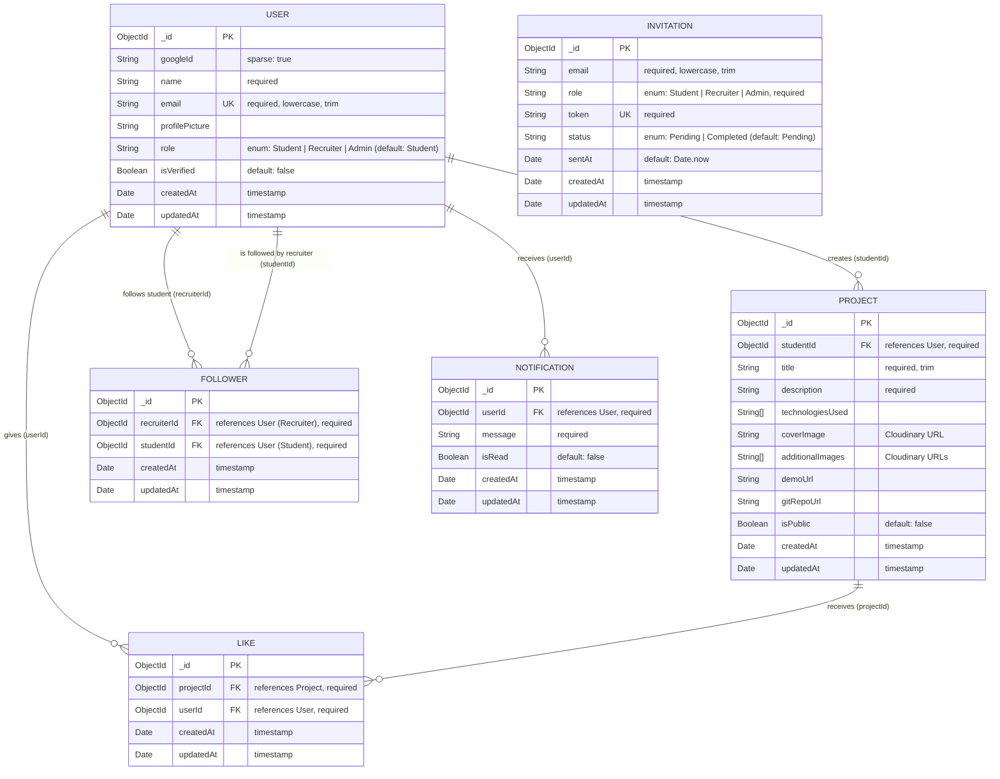
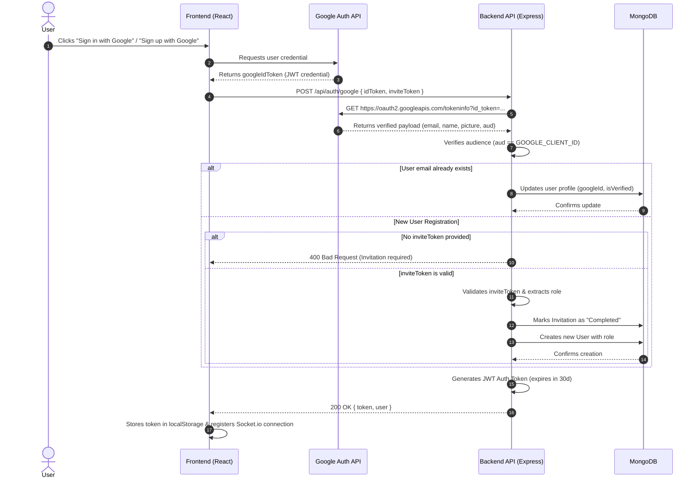
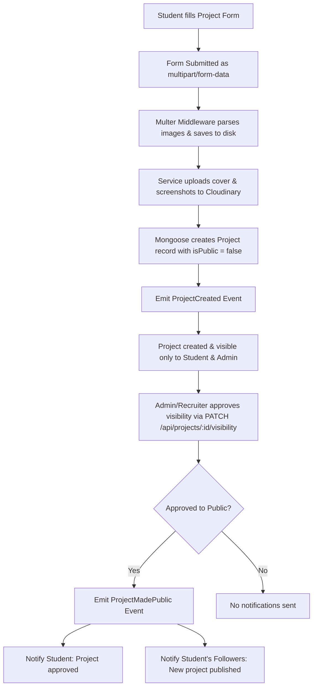
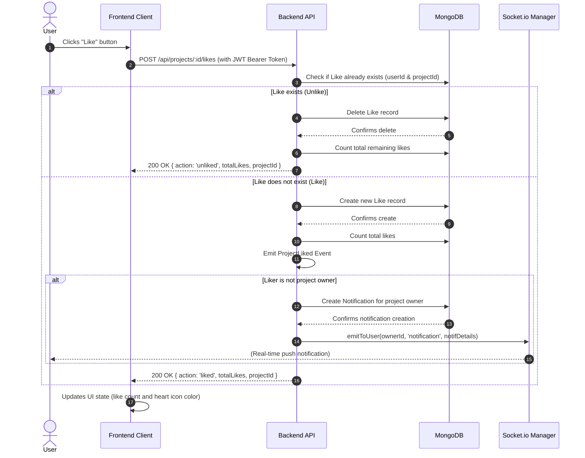

# UniShowcase System Documentation

Welcome to the **UniShowcase** system documentation. This document outlines the architecture, database schema, workflow flows, and API endpoints of the application.

---

## 1. Entity Relationship Diagram (ERD)

The database is built on **MongoDB** using **Mongoose** as the Object Data Modeling (ODM) library. The schema consists of six core collections: `User`, `Project`, `Like`, `Follower`, `Invitation`, and `Notification`.

Below is the entity-relationship representation using Mermaid:



### Relationship Constraints
* **Duplicate Likes**: Prevents duplicate likes from the same user on the same project using a compound unique index on `{ projectId: 1, userId: 1 }`.
* **Duplicate Follows**: Prevents recruiter from following the same student twice via a compound unique index on `{ recruiterId: 1, studentId: 1 }`.
* **Unique Invitations**: Ensures each invitation token is unique.

---

## 2. System Workflow Flows

This section details the primary interactions and operations across the frontend and backend.

### 2.1 OAuth Login / Register Flow

UniShowcase utilizes **Google Sign-In (Google Identity Services)** client-side script, paired with backend verification and token validation.



#### Detailed Description
1. **Credential Retrieval**: The frontend client loads `https://accounts.google.com/gsi/client` and initializes it with the Google Client ID. When a user authenticates, Google returns an ID token containing profile info.
2. **Payload Verification**: The frontend sends the `idToken` (and `inviteToken` if registering) to the backend. The backend issues an HTTP GET to Google's tokeninfo API to confirm validation.
3. **Invite Code Gatekeeping**:
   * If a user is not yet registered, they **must** have a valid `inviteToken`. If no token is provided, authentication fails.
   * If an `inviteToken` is provided, it is decrypted and validated. The user's role is determined by the invitation. The invitation is marked `Completed`, and the new user is saved.
4. **Token Generation**: Upon successful verification, the backend issues a JWT session token valid for 30 days.

---

### 2.2 Create Project Flow

Projects are created by Students, uploaded with images, and start as **Private** until approved by an Admin or Recruiter.



#### Detailed Description
1. **Submission**: The student fills in details (title, description, demo link, github repo, technologies) and uploads a cover image plus up to 5 screenshots. This is sent as `multipart/form-data`.
2. **Image Processing**:
   * The backend's Multer middleware intercepts the files and saves them to local disk `/uploads`.
   * The backend uploads images to **Cloudinary** (covers go to `/projects/covers` and screenshots go to `/projects/additional`).
3. **Database Write**: The project is saved with `isPublic: false` and the current student's ID.
4. **Approval & Event emission**:
   * The project remains private until an Admin/Recruiter toggles `isPublic` to true.
   * When updated, if it transitions from private to public, a `ProjectMadePublic` event is fired.
   * This event creates a Notification for the student and notifies all recruiters following this student, pushing notifications over Socket.io in real-time.

---

### 2.3 Like Project Flow

The like project flow is structured to be real-time and toggle-based.



#### Detailed Description
1. **Toggle Action**: The endpoint `POST /api/projects/:id/likes` checks if a record matching `{ projectId, userId }` exists. If yes, it is deleted (unliked). If not, it is created (liked).
2. **Notification Event**: On a new like, if the liker is not the project owner, a notification is saved to the database.
3. **Real-time Push**: The backend pushes the notification details dynamically if the project owner's socket is connected.

---

## 3. API Documentation

All routes require authentication via a standard `Authorization: Bearer <token>` header, except for public access checks and the OAuth sign-in endpoint.

### 3.1 Authentication `/api/auth`

| Method | Endpoint | Access Role | Description |
| :--- | :--- | :--- | :--- |
| `POST` | `/api/auth/google` | Public | Auth/register using Google ID Token and optional `inviteToken`. |
| `POST` | `/api/auth/invite` | Admin | Generates a single invite token for a given email and role, sending an invitation email. |
| `POST` | `/api/auth/invite/bulk` | Admin | Generates and sends multiple invitations in a batch. |
| `GET` | `/api/auth/invitations` | Admin | Retrieves a list of all invitations, sorted by creation date. |

### 3.2 Projects `/api/projects`

| Method | Endpoint | Access Role | Description |
| :--- | :--- | :--- | :--- |
| `POST` | `/api/projects` | Student | Creates a new project. Accepts `multipart/form-data`. |
| `GET` | `/api/projects` | All Roles | Lists projects with search/technology filters. Visibility rules apply. |
| `GET` | `/api/projects/liked` | All Roles | Lists projects liked by the authenticated user. |
| `GET` | `/api/projects/:id` | All Roles | Retrieves a single project's details. Private projects restricted to owner/admin. |
| `PUT` | `/api/projects/:id` | Owner / Admin | Updates project fields or screenshots. |
| `DELETE` | `/api/projects/:id` | Owner / Admin | Deletes a project. |
| `PATCH` | `/api/projects/:id/visibility`| Recruiter / Admin| Approves or revokes public visibility. |
| `POST` | `/api/projects/:id/likes` | All Roles | Toggles like/unlike status. |
| `GET` | `/api/projects/:id/likes` | All Roles | Gets project like count and check if current user liked it. |

### 3.3 Interactions `/api`

| Method | Endpoint | Access Role | Description |
| :--- | :--- | :--- | :--- |
| `POST` | `/api/users/:studentId/follow` | Recruiter | Toggles follow/unfollow status on a student. |
| `GET` | `/api/users/:studentId/follow-status` | Recruiter | Gets following status for a student. |

### 3.4 Notifications `/api/notifications`

| Method | Endpoint | Access Role | Description |
| :--- | :--- | :--- | :--- |
| `GET` | `/api/notifications` | All Roles | Gets notifications for the current user. |
| `PATCH` | `/api/notifications/read-all` | All Roles | Marks all notifications for the user as read. |
| `PATCH` | `/api/notifications/:id/read` | All Roles | Marks a specific notification as read. |

### 3.5 User Management `/api/users`

| Method | Endpoint | Access Role | Description |
| :--- | :--- | :--- | :--- |
| `GET` | `/api/users` | Admin / Recruiter| Retrieves all users. |
| `PATCH` | `/api/users/:id` | Admin | Updates user information (e.g. role assignment). |
| `DELETE` | `/api/users/:id` | Admin | Deletes a user. |

---

## 4. Appendix

### 4.1 System Environment Variables

#### Backend Configurations (`.env`)
```ini
# Server Setup
PORT=5000
NODE_ENV=production

# Database
MONGODB_URI=mongodb://127.0.0.1:27017/net_centric_app

# JWT Signings
JWT_SECRET=your_jwt_secret

# Google API Credentials
GOOGLE_CLIENT_ID=your_google_client_id
GOOGLE_CLIENT_SECRET=your_google_client_secret
GOOGLE_CALLBACK_URL=http://localhost:5000/api/auth/google/callback

# Allowed Client Origin
FRONTEND_URL=http://localhost:5173

# Cloudinary Setup (Image storage)
CLOUDINARY_CLOUD_NAME=your_cloudinary_name
CLOUDINARY_API_KEY=your_cloudinary_key
CLOUDINARY_API_SECRET=your_cloudinary_secret

# Nodemailer Configuration (Transporter)
EMAIL_HOST=smtp.mailtrap.io
EMAIL_PORT=2525
EMAIL_USER=your_smtp_username
EMAIL_PASS=your_smtp_password
```

#### Frontend Configurations (`.env`)
```ini
VITE_BACKEND_URL=http://localhost:5000
VITE_GOOGLE_CLIENT_ID=your_google_client_id
```

### 4.2 WebSockets and Real-time Architecture
Socket.io is initialized on connection. Right after the handshake, the frontend registers the connection using the `'register'` event, passing the user ID. This links the socket ID to the user ID in the backend socket manager. Real-time events, such as new project approvals or likes, trigger notifications which are instantly dispatched to the target socket if connected.
